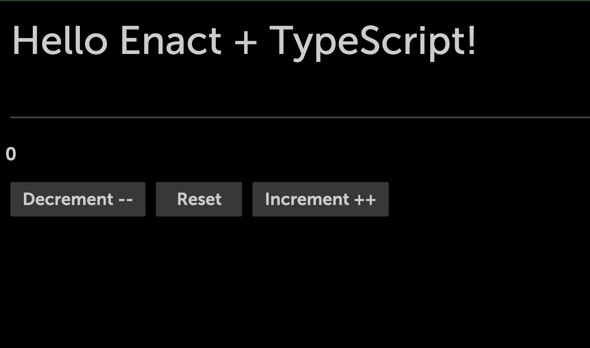

### Counter Component using TypeScript with Enact

We can use the same Counter.tsx file, remove the previous content and add the following contents:

```js
//Counter.tsx

import * as React from 'react';
import Button from '@enact/moonstone/Button';
import kind from '@enact/core/kind';

const CounterBase = kind({
    name: 'Counter',

    defaultProps: {
        count: 0
    },

    render: ({onIncrementClick, onDecrementClick, onResetClick, count, ...rest}) => (
        <div>
            <h1>{count}</h1>
            <Button onClick={onDecrementClick}>Decrement --</Button>
            <Button onClick={onResetClick}>Reset</Button>
            <Button onClick={onIncrementClick}>Increment ++</Button>
        </div>
    )
});

export {
    CounterBase
};

```

### View the Counter in the browser



The above code holds the definition of `counter` component. Using `Kind` we are binding defaultProps, render and all the events together.

> Please check API documentation in Core Library to know more about [Kind] (`https://enactjs.com/docs/modules/core/kind/`) and [handle](`https://enactjs.com/docs/modules/core/handle/`)

We will add `handler` inside the `kind` to handle the click event on the buttons.

```js
    handlers: {
        onDecrementClick: createHandler(count => count - 1),
        onIncrementClick: createHandler(count => count + 1),
        onResetClick: createHandler(() => 0)
    },
```

- Application will use `ui/Changeable` for state management of the `count` based on the event trigger

```js
import Changeable from '@enact/ui/Changeable';
```

 > Applying Changeable to a component will pass two additional props: the current value from state and an event callback to invoke when the value changes. More information related to [ui/Changeable] (`https://enactjs.com/docs/modules/ui/Changeable/`)
 will be available inside UI Library

```js

const Counter = Changeable({prop: 'count' , change: 'onCounterChange'}, CounterBase);

```

- Add the new `counter` const to the export default.

```js
export default Counter;
```

- Create a handle function to  click event on the button. `createHandler` function will take function as input, use the function input value to update the `count`. By using `handle` we will forward the call to the callback function defined in changeable `onCounterChange`

```js
function createHandler(fn) {
    return handle(
        adaptEvent((ev, {count}) => ({
            type: 'onCounterChange',
            count: fn(count)
        }),
        forward('onCounterChange')
        )
    )
}
```

We’re using React.FunctionComponent and defining the object structure of our expected props. In this scenario we’re expecting to be passed in a single prop named count and we’re defining it in-line. We can also define this in other ways, by creating an interface such as Props:

> Inject Typescript types to the handler and props so the compiler will use the right type while parsing the values for props and functions


```js

interface CounterProps {
    count? : number,
    onCounterChange? : void
}

type handlerFunctionType = (count: number) => number;

function createHandler(fn:handlerFunctionType) {
    ...
}

const CounterBase = kind<CounterProps>({

...
});

```

Then, inside of MainPanel.tsx, we can load the Counter

### ./src/views/MainPanel.tsx
```js

//Custom component
import Counter from '../components/Counter'

const MainPanel = kind({
    name: 'MainPanel',

    render: (props) => (
        <Panel {...props}>
            <Header title="Hello Enact + TypeScript!" />
            <Counter />
        </Panel>
    )
});

export default MainPanel;
```

### Counter view in the browser


### Error Handling

Building Counter app, You might get the following TS error, when `count` is added as a default prop but type is not defined.

```bash

TypeScript error: Parameter 'count' implicitly has an 'any' type.

```
You are using the --noImplicitAny and TypeScript don't know about the type of Users object. In this case, you need to explicitly define the `count` type Or define the type of `count` in the interface.

```js
interface CounterProps {
    count? : number
}
```
OR

```js
let count : number = 0;
```

## Conclusion

Using TypeScript with enact we were able to created a reusable counter component. This tutorial introduced you to interface, assertion and different data types of TypeScript. Integrating TypeScript with Enact helped us to extend our knowledge in using `kind` and `handler` in developing reuseable component.