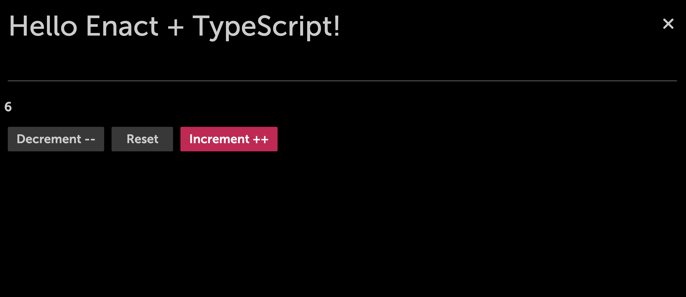

### Counter Component using TypeScript with Enact

We can use the same **Counter.tsx** file, remove the previous content and add the following contents:

```ts
//Counter.tsx

import * as React from 'react';
import Button from '@enact/moonstone/Button';
import kind from '@enact/core/kind';

const CounterBase = kind({
    name: 'Counter',

    defaultProps: {
        count: 0
    },

    render: ({onIncrementClick, onDecrementClick, onResetClick, count, ...rest}) => (
        <div>
            <h1>{count}</h1>
            <Button onClick={onDecrementClick}>Decrement --</Button>
            <Button onClick={onResetClick}>Reset</Button>
            <Button onClick={onIncrementClick}>Increment ++</Button>
        </div>
    )
});

export default CounterBase;
```

### View the Counter in the Browser


The above code holds the definition of the `Counter` component. Using `kind()` we are binding `defaultProps`, `render` and all the events together.

> Please check API documentation in the Core Library to know more about [kind](../../../modules/core/kind/) and [handle](../../../modules/core/handle/)

We will add `handler` inside the `kind` declaration to handle the click event on the buttons:

```ts
    handlers: {
        onDecrementClick: createHandler(count => count - 1),
        onIncrementClick: createHandler(count => count + 1),
        onResetClick: createHandler(() => 0)
    },
```

- Use `ui/Changeable` for state management of `count`

```ts
import Changeable from '@enact/ui/Changeable';
```

 > Applying `Changeable` to a component will pass two additional props: the current value from state and an event callback to invoke when the value changes. For more information, read the [ui/Changeable documentation](../../../modules/ui/Changeable/)

```ts
const Counter = Changeable({prop: 'count' , change: 'onCounterChange'}, CounterBase);

```

- Change the default export to the new `Counter` component:

```ts
export default Counter;
```

- Create a handle function for click events on the button. The `createHandler` function will take a function as input then use the function to update the `count`. By using `handle` we will forward the call to the callback function (`onCounterChange`) defined in `Changeable`:

```ts
function createHandler(fn) {
    return handle(
        adaptEvent((ev, {count}) => ({
            type: 'onCounterChange',
            count: fn(count)
        }),
        forward('onCounterChange')
        )
    )
}
```

We’re using `React.FunctionComponent` and defining the object structure of our expected props. In this scenario we’re expecting to be passed in a single prop named count and we’re defining it in-line. We can also define this in other ways, by creating an interface such as Props:

> Inject Typescript types to the handler and props so the compiler will use the right type while parsing the values for props and functions.

```ts
interface CounterProps {
    count? : number,
    onCounterChange? : void
}

type handlerFunctionType = (count: number) => number;

function createHandler(fn: handlerFunctionType) {
    ...
}

const CounterBase = kind<CounterProps>({

...
});

```


### Counter View in the Browser




### Error Handling

Building the Counter app, you might get the following TS error, when `count` is added as a default prop but type is not defined.

```none
TypeScript error: Parameter 'count' implicitly has an 'any' type.
```

You are using the --noImplicitAny and TypeScript doesn't know about the type of Users object. In this case, you need to explicitly define the `count` type or define the type of `count` in the interface.

```ts
interface CounterProps {
    count? : number
}
```
OR

```ts
let count : number = 0;
```

## Conclusion

Using TypeScript with enact we were able to create a reusable counter component. This tutorial introduced you to interface, assertion and different data types of TypeScript. Integrating TypeScript with Enact helped us to extend our knowledge in using `kind` and `handler` in developing s reuseable component.
